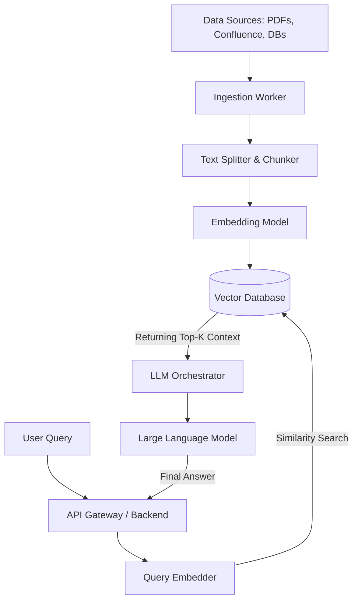

# Architecting a Scalable RAG Pipeline

When designing a Retrieval-Augmented Generation (RAG) system for enterprise, the challenge is rarely the LLM itself. The true architectural complexity lies in data ingestion, vector embeddings, and low-latency retrieval under load.

---

## Architecture Overview

A robust RAG system typically consists of three distinct phases:

1. **Ingestion & Indexing:** Converting raw unstructured data into normalized, chunked, and embedded vectors.
2. **Retrieval:** Searching the high-dimensional vector space for the most semantically relevant text chunks.
3. **Generation:** Injecting those chunks into an LLM prompt to synthesize an answer.

### System Diagram

---

## 1. The Ingestion Pipeline

Our data ingestion architecture relies on asynchronous workers (e.g., Celery or Temporal) completely isolated from the query API.

- **Chunking Strategy:** We employ a recursive character text splitter. Instead of blindly cutting at 1000 tokens, it attempts to break paragraphs, then sentences, preserving semantic boundaries.
- **Overlap:** A 20% overlap between chunks ensures that contextual references (like "However, it..." referring to the previous paragraph) are maintained.

## 2. The Vector Database Engine

We needed a vector store capable of horizontal scaling and sub-50ms HNSW (Hierarchical Navigable Small World) index searches.

We chose an infrastructure deployed via Helm onto our internal Kubernetes cluster to manage memory pressure. The vectors index contains metadata filters (e.g., `document_type`, `department_access`) allowing us to implement Role-Based Access Control (RBAC) at the retrieval layer.

## 3. Real-Time Retrieval and Generation

When the FastAPI node receives a query, it does not immediately query the vector DB.

1. **Query Rewriting:** We use a lightweight LLM call to rewrite the user's conversational query into an optimized search string.
2. **Hybrid Search:** We execute a dense vector search alongside a traditional BM25 sparse keyword search, merging the results using Reciprocal Rank Fusion (RRF). This ensures highly specific proprietary terms are not lost in the vector space.
3. **Prompt Injection:** We enforce a strict LangChain prompt that forces the LLM to only answer based on the provided context, significantly reducing hallucination risks.

---

## Conclusion

By decoupling ingestion from retrieval, and applying hybrid search methodologies, we built a highly accurate, defensible LLM application. RAG architecture is less about AI, and more about traditional distributed systems data engineering.
